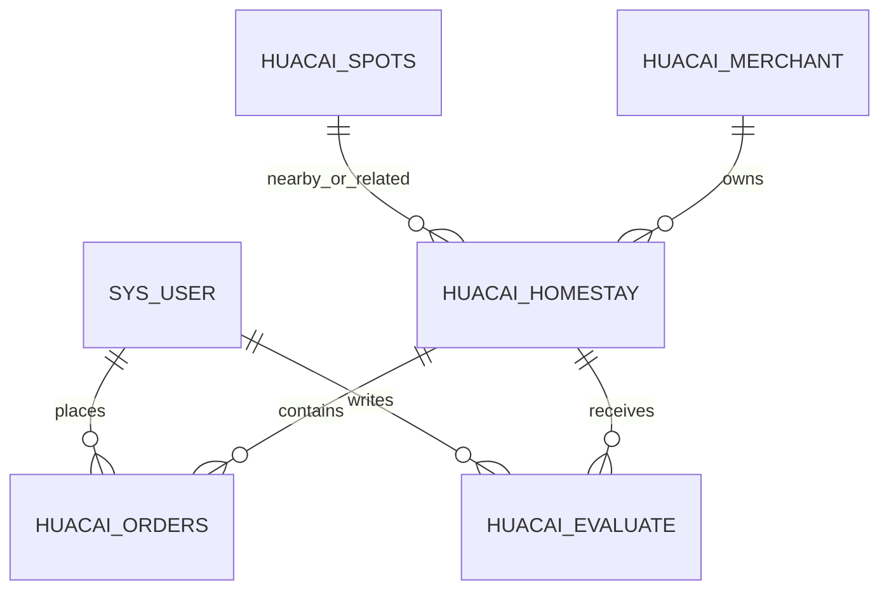

# 数据库说明

## 1. 结论先说

当前仓库是前端仓库，不包含：

- SQL 建表脚本
- 数据库迁移文件
- Java 实体类
- Mapper / Repository
- 后端 ORM 配置

因此本文件中的数据库结构属于“基于前端字段和接口命名的推断”，不是最终权威数据库设计文档。

如果你准备把项目上传到 GitHub，本文件适合作为“前端可见数据库模型说明”。  
如果要达到可部署级别，仍需要补充后端 SQL 或数据库设计文档。

## 2. 可推断的核心业务实体

### 2.1 用户表 `sys_user`

前端直接使用到的字段至少包括：

- `userId`
- `userName`
- `nickName`
- `avatar`
- `balance`
- `status`

推断来源：

- `src/store/modules/user.js`
- `src/views/HomePage/recharge.vue`
- `src/views/HomePage/index.vue`
- `src/api/system/user.js`

### 2.2 民宿表 `huacai_homestay`

前端直接使用到的字段至少包括：

- `homestayId`
- `title`
- `description`
- `image`
- `location`
- `price`
- `facilities`

推断来源：

- `src/views/HomePage/home.vue`
- `src/views/HomePage/homestay.vue`
- `src/views/components/RoomReservation/index.vue`
- `src/api/huacai/homestay.js`

### 2.3 景点表 `huacai_spots`

前端直接使用到的字段至少包括：

- `spotsId`
- `name`
- `description`
- `image`
- `location`
- `openingHours`

推断来源：

- `src/views/HomePage/scenicSpots.vue`
- `src/views/HomePage/home.vue`
- `src/api/huacai/spots.js`

### 2.4 订单表 `huacai_orders`

前端直接使用到的字段至少包括：

- `orderId`
- `homestayId`
- `userId`
- `title`
- `location`
- `price`
- `checkInDate`
- `checkOutDate`
- `days`
- `totalAmount`
- `status`
- `createTime`

推断来源：

- `src/views/HomePage/booking.vue`
- `src/views/components/RoomReservation/index.vue`
- `src/api/huacai/orders.js`

### 2.5 评价表 `huacai_evaluate`

前端直接使用到的字段至少包括：

- `evaluateId`
- `homestayId`
- `rating`
- `content`
- `nickName`
- `image`
- `createTime`

推断来源：

- `src/views/HomePage/booking.vue`
- `src/views/components/RoomReservation/index.vue`
- `src/api/huacai/evaluate.js`

### 2.6 商家表 `huacai_merchant`

虽然用户侧页面未直接使用，但前端 API 已包含商家 CRUD，说明数据库中大概率存在商家表：

- `merchantId`
- 商家基础信息字段

推断来源：

- `src/api/huacai/merchant.js`

### 2.7 标签与关联表

前端中出现了：

- `spotsTagsList`
- `homestayTagsList`

因此大概率存在以下类型的表：

- 景点标签表
- 民宿标签表
- 景点-标签关联表
- 民宿-标签关联表

## 3. 推断出的实体关系

说明：

- `景点 -> 民宿` 的关系在前端表现为“根据景点查询附近民宿”，具体是一对多还是多对多，前端无法最终确认。
- `商家 -> 民宿` 的关系也只能根据命名推断。

## 4. 订单状态

订单状态通过字典 `orders_status` 渲染，而不是写死前端枚举，这意味着后端数据库中大概率还存在字典表：

- `sys_dict_type`
- `sys_dict_data`

订单状态常见候选值可能包括：

- 待支付
- 已完成
- 已取消
- 已退款

说明：以上中文状态是根据界面表现推断，真实存储值可能是编码值。

## 5. 工作流相关表

当前前端包含 `activiti` 与 BPMN 相关模块，因此如果后端启用了工作流，数据库还可能存在：

- Activiti / Flowable 流程定义表
- 流程实例表
- 任务表
- 历史任务表
- 审批意见表

这部分表结构取决于具体后端引擎版本。

## 6. 当前数据库文档的边界

本仓库能够确认的是“前端依赖哪些数据”。  
本仓库不能确认的是：

- 最终使用的是 MySQL、PostgreSQL 还是其他数据库
- 精确字段类型
- 精确索引设计
- 外键约束
- 唯一键设计
- 审计字段是否统一

## 7. 如果你要把项目开源，建议补充

建议后续再补一份真正可落地的数据库文档，至少包括：

1. 数据库类型与版本
2. 建表 SQL
3. 初始化数据
4. 字典数据
5. 默认账号说明
6. 业务表关系图

如果后端仓库存在，推荐直接在 README 中链接到后端 SQL 目录。
